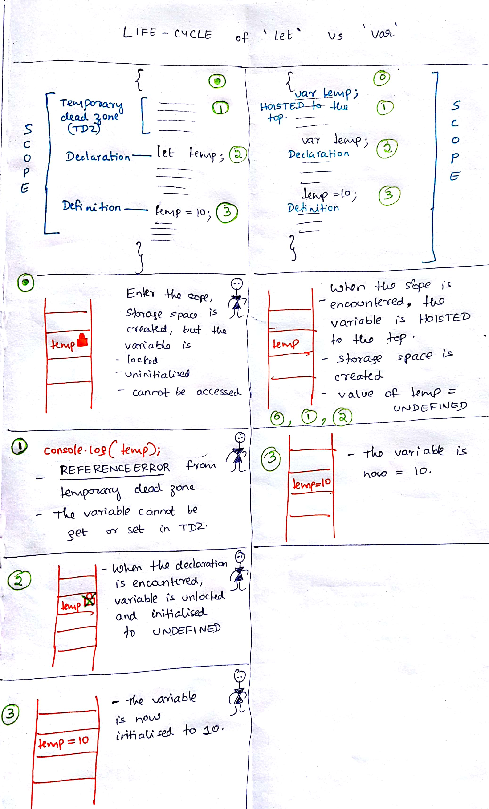

**What is the temporal dead zone?**

A variable declared by let has a temporal dead zone (TDZ). When entering its scope, it cannot be accessed until the execution reaches its declaration.
_In simpler words, `let` variables aren't hoisted._

**What is hoisting?**
Hoisting is a JavaScript mechanism where variables and function declarations are moved to the top of their scope before code execution.
[Example](./letvsvar.md#hoisting)

**The TDZ via tech-cartoons**

